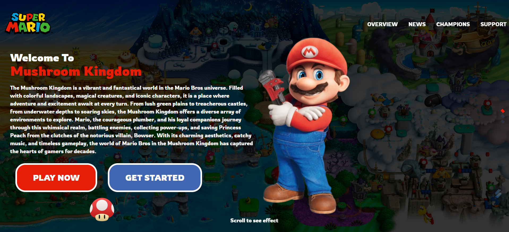

# SUPER MARIO BROSS (Landing Page)

<p align="center">
    
</p>

<p align="center">
    
</p>

The Mario Bros Movie Landing Page is a website designed to promote and generate expectations around the release of the upcoming Mario Bros movie. The main objective of the page is to provide information about the movie, highlight the main characters and present a captivating trailer that awakens the interest of visitors.

For the development of this Landing Page, modern tools and technologies were used to achieve an interactive and attractive experience. The JavaScript framework chosen was React, which allows an efficient construction of user interfaces through reusable components. In addition, Vite, a fast compilation tool, was used to optimize performance and page loading speed.

The visual design of the site was based on the iconic Mario Bros aesthetic, using bright colors and graphic elements representative of the game's world. The page structure was divided into intuitive sections that include an introduction to the film's plot, detailed information about the main characters, and an exciting trailer that plays directly on the page.

To improve presentation and usability, SASS (Syntactically Awesome Style Sheets), a CSS preprocessor that allows cleaner, more modular code to be written, was used. This made it possible to apply sophisticated styles to the different elements of the page, achieving an attractive and coherent design.

### Install

1 - The repository is downloaded.

3 - The following command is executed:

```
npm install
```

command to install the dependencies.

### Dev Mode

To start the project, the following command is executed

```
npm run dev
```

To access the data we place the following addresses in our browser with direction <http://localhost:3000>.

### Compiled

To compile the project, the following command is executed

```
npm run build
```

And use the files in the dist folder.

## Preview

To visualize the project we only have to execute the following command:

```
npm run preview
```

## DEMO

Enter the project demo [here.](https://super-mario-lp.netlify.app/)

## Technologies used


